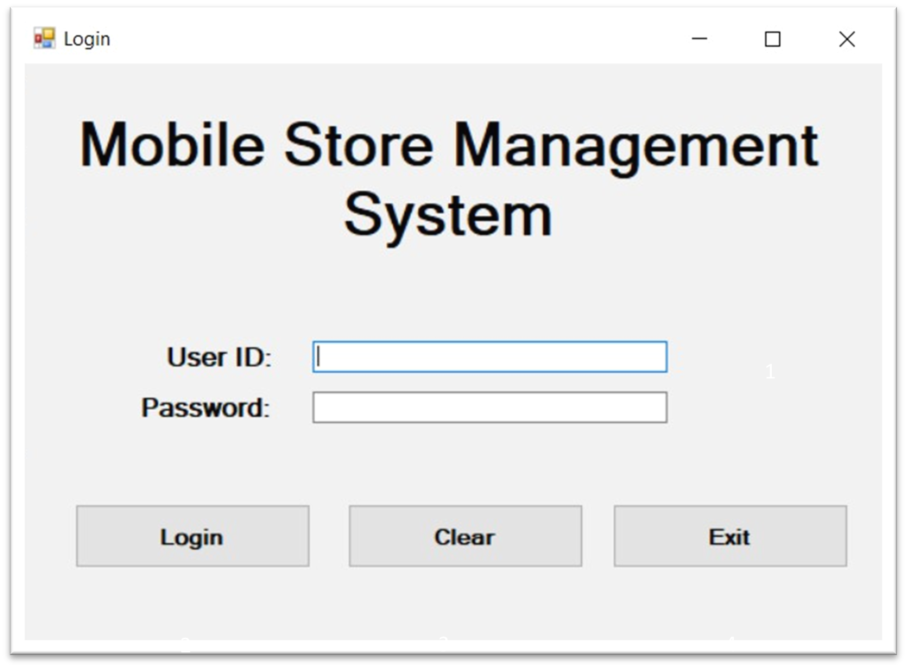

# Mobile Store Management System

**Mobile Store Management System** is a Final Year Project (FYP) developed using **VB.NET** and **MSSQL LocalDB**.  
It provides an all-in-one solution for managing mobile store operations including inventory, sales, staff attendance, and reporting.

> **Noted:** The original project files (e.g., Visual Studio `.sln` and configuration files) were lost after submission.  
> This repository contains the recovered source code, but you may need to:
>
> - Create a new VB.NET Windows Forms project in Visual Studio
> - Add the existing source code files into the project
> - Reconfigure the database connection string
>
> The "How to Run" section below is kept for reference.

## Features

- **User Authentication**: Simple login and registration system with role-based access, directing Admin and Staff users to their respective page.
- **Inventory Management**: Add, edit, delete, and search products; record stock input and output
- **Sales Records**: Track sales date, salesman details, customer information, and total price
- **Staff Attendance**: Record check-in/check-out and access attendance history
- **Data Filtering**: Filter records by date, status, or keyword
- **Local Database**: All data stored in MSSQL LocalDB

## Tech Stack

- **Language**: VB.NET
- **Database**: MSSQL LocalDB
- **UI Framework**: Windows Forms
- **IDE**: Visual Studio 2019

## How to Run

1. Clone this repository to your local machine.
2. Open the solution inside the `src` folder using Visual Studio.
3. Locate the SQL script in the `database` folder and run it on MSSQL LocalDB.
4. Update the connection string in `Login.vb` and `StaffMainForm.vb` to match your database setup.
5. Build and run the project (press **F5** in Visual Studio).

## Screenshots

- **Login Page**

  

- **Sales Page (Admin)**

  

- **Staff Page (Admin)**

  

- **Attendance Page (Admin)**

  

- **Store Page (Admin)**

  

- **Attendance Page (Staff)**

  

- **Store Page (Staff)**

  

- **Sales Page (Staff)**

  
